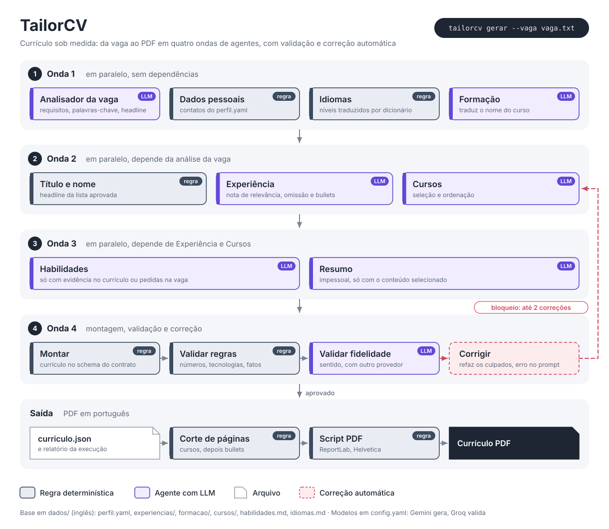

# TailorCV

Currículo sob medida para cada vaga. Você cola o texto da vaga num arquivo, roda um comando e recebe um PDF adaptado àquela vaga, montado a partir de uma base com as suas experiências.

```bash
tailorcv gerar --vaga vagas/engenheira-ia-empresa-x.txt
```

A adaptação é feita por um sistema multiagente em LangGraph. Cada parte do currículo tem um agente próprio, e dois validadores conferem o resultado contra a sua base antes de gerar o PDF, para que a IA **nunca invente** experiência, tecnologia ou número.

## O problema

Adaptar o currículo a cada vaga faz diferença na triagem, tanto humana quanto por sistemas de ATS, mas é trabalho manual e repetitivo. Pedir a uma IA genérica para "adaptar o currículo" resolve a parte do trabalho e cria outra: ela tende a inflar o que você fez, trocar "participei" por "liderei" e inventar métricas que soam bem.

O TailorCV separa o que exige julgamento do que é fato:

- **A IA decide** o que é relevante para a vaga, como traduzir e como enfatizar.
- **O código garante** os fatos: empresa, datas, números, tecnologias e nomes de cursos vêm da sua base, e qualquer afirmação sem origem bloqueia o currículo.

## Como funciona



O fluxo é um grafo LangGraph com 13 nós em quatro ondas. Os nós da mesma onda rodam em paralelo, e um painel no terminal mostra o andamento de cada um.

1. **Onda 1.** O Analisador lê a vaga e extrai cargo, requisitos, palavras-chave e o título mais aderente. Em paralelo, as regras montam dados pessoais e idiomas, e a Formação traduz os nomes dos cursos.
2. **Onda 2.** A Experiência dá uma nota de relevância a cada experiência, omite as que ficam abaixo do corte e adapta os bullets. Cursos seleciona e ordena as certificações.
3. **Onda 3.** Habilidades escolhe só o que tem evidência no currículo ou é pedido na vaga. O Resumo é escrito a partir do conteúdo já selecionado.
4. **Onda 4.** O currículo é montado e passa por dois validadores. Se algum bloquear, o nó Corrigir refaz o agente culpado com o problema no prompt e valida de novo.

Depois da aprovação, o conteúdo é cortado automaticamente se passar do limite de páginas, e o PDF é gerado.

## Como o TailorCV evita invenções

A confiabilidade vem de camadas, e não de pedir à IA que "não invente":

| Camada | O que faz |
| --- | --- |
| **Fatos por código** | Empresa, datas, modalidade, instituição e nomes de curso nunca passam pela LLM: são copiados da sua base. |
| **Rastreabilidade** | Cada bullet gerado aponta para o ID do bullet de origem. |
| **Validador de regras** | Bloqueia número que não existe na origem (entendendo que 2.000 e 2,000 são o mesmo número), tecnologia fora das tags, habilidade fora da base, datas divergentes e palavras proibidas. É determinístico e grátis. |
| **Validador de fidelidade** | Uma LLM de **outro provedor** compara cada item em português com a origem em inglês e bloqueia inflação de escopo ou senioridade, afirmações sem lastro e traduções que mudam o sentido. Exemplo real: "redução de 30% dos gastos da empresa" é bloqueado quando a origem diz "30% reduction in monthly Bedrock spend". |
| **Correção automática** | Um bloqueio refaz só o agente culpado e os que dependem dele, com o erro no prompt, até 2 vezes. Se não resolver, nenhum PDF é gerado. |
| **Corte que só remove** | Para caber no limite de páginas, o sistema remove cursos e bullets de menor relevância. Ele nunca reescreve. |

Cada execução gera um relatório com a nota e o motivo de cada experiência incluída ou omitida, o resultado das validações, as correções e os cortes.

## Instalação

**Requisitos:** Python 3.12 e [uv](https://docs.astral.sh/uv/).

```bash
git clone https://github.com/<seu-usuario>/tailor-cv.git
cd tailor-cv
uv sync
cp .env.example .env
```

Preencha o `.env` com as chaves. As duas têm plano gratuito:

- `GOOGLE_API_KEY`: crie em [aistudio.google.com](https://aistudio.google.com) (Gemini, usado pelos agentes).
- `GROQ_API_KEY`: crie em [console.groq.com](https://console.groq.com) (usado pelo validador de fidelidade).

Para usar o comando `tailorcv` sem o prefixo `uv run`, ative o ambiente virtual (`source .venv/bin/activate`, ou `source .venv/Scripts/activate` no Git Bash do Windows).

## Primeiro uso, com os dados de exemplo

O repositório traz uma base fictícia em `exemplos/`, útil para conhecer o fluxo antes de escrever a sua:

```bash
uv run tailorcv checar --dados exemplos/dados
uv run tailorcv gerar --vaga exemplos/vagas/vaga.exemplo.txt --dados exemplos/dados
```

O currículo sai em `curriculos/curriculo.vaga.exemplo.pdf`, e o relatório em `execucoes/<data>_vaga.exemplo/relatorio.md`.

## Montando a sua base

A base fica em `dados/`, escrita **em inglês**; o currículo sai em português. A pasta está no `.gitignore`, então seus dados nunca vão para o repositório. Use `exemplos/dados/` como modelo.

```
dados/
├── perfil.yaml          # nome, contatos e títulos (headlines) aceitos, em português
├── experiencias/        # uma experiência por arquivo
├── formacao/            # uma formação por arquivo
├── cursos/              # um curso ou certificação por arquivo
├── habilidades.md       # seções ## Technical e ## Behavioral
└── idiomas.md           # - English: advanced
```

Uma experiência:

```markdown
---
id: empresa-alfa
company: Empresa Alfa
role: AI Engineer
start: 2023-03
end: present
work_mode: hybrid          # opcional: remote | hybrid | onsite
always_include: false      # opcional: nunca omitir esta experiência
---

## Context
Internal AI platform team serving business areas.

## Achievements
- [alfa-rag] Built and deployed a production RAG chatbot on AWS.
  - tech: AWS Bedrock, OpenSearch, ECS Fargate, Python
  - metric: used by 2,000 employees
```

Algumas dicas para uma base que rende bons currículos:

- **Escreva mais do que cabe num currículo.** A seleção por vaga só funciona se houver o que selecionar.
- **Coloque números em `metric:`.** Só números presentes na origem podem aparecer no currículo. Um bullet sem número é melhor que um número duvidoso.
- **Liste as tecnologias em `tech:`.** Elas limitam o que cada bullet pode citar e comprovam as habilidades técnicas.
- **Use `always_include: true`** para experiências que você nunca quer omitir, como o emprego atual.
- Arquivos que começam com `_` são ignorados e servem de modelo.

Confira a base sempre que editar. O comando aponta problemas com o arquivo e a linha exatos, sem chamar nenhuma LLM:

```bash
uv run tailorcv checar
```

## Comandos

| Comando | O que faz | Chama LLM |
| --- | --- | --- |
| `tailorcv gerar --vaga <vaga.txt>` | Gera o JSON e o PDF | Sim |
| `tailorcv json --vaga <vaga.txt>` | Roda os agentes e a validação e salva o JSON | Sim |
| `tailorcv pdf <curriculo.json>` | Gera o PDF a partir de um JSON | Não |
| `tailorcv checar` | Confere a base de dados | Não |
| `tailorcv validar <curriculo.json> [--fidelidade]` | Confere um JSON, inclusive editado à mão | Só com `--fidelidade` |

Todos aceitam `--dados <pasta>` para usar outra base.

### Fluxo para uma vaga real

1. Cole o texto da vaga em `vagas/<empresa-cargo>.txt`, sem formatar nada.
2. Rode `tailorcv gerar --vaga vagas/<empresa-cargo>.txt`.
3. Leia o `relatorio.md` da execução: notas, omissões e alertas.
4. Se quiser ajustar algo, edite `curriculos/curriculo.<empresa-cargo>.json`, confira com `tailorcv validar ... --fidelidade` e gere de novo com `tailorcv pdf`, sem nova chamada aos agentes.

## Configuração

Tudo fica no `config.yaml`.

**Modelos.** Cada agente usa o modelo que você definir, no formato `provedor:modelo`:

```yaml
modelos:
  analisador:  google_genai:gemini-3.7-flash
  experiencia: google_genai:gemini-3.8-flash
  resumo:      google_genai:gemini-3.7-flash
  formacao:    google_genai:gemini-3.5-flash-lite
  cursos:      google_genai:gemini-3.5-flash-lite
  habilidades: google_genai:gemini-3.5-flash-lite
  validador:   groq:openai/gpt-oss-120b
```

Trocar de provedor não exige mudar código: basta mudar a string (`anthropic:...`, `openai:...`, `ollama:...`) e instalar o pacote LangChain correspondente, por exemplo `uv add langchain-anthropic`. Mantenha o validador num provedor **diferente** dos agentes geradores; modelos iguais tendem a concordar com os próprios erros.

**Limites.** Páginas, número de correções automáticas, tamanho de bullets e resumo, nota de corte das experiências e máximo de cursos e habilidades.

**Palavras proibidas.** Adjetivos vazios que bloqueiam o currículo se aparecerem, como "proativa" ou "apaixonada".

**Traduções fixas.** O `i18n_pt.yaml` traduz níveis de idioma, nomes de idiomas e modalidades de trabalho por regra.

### Cotas gratuitas

No plano gratuito, o Gemini limita as chamadas por dia **para cada modelo**. Uma execução faz até 7 chamadas (6 quando a análise da vaga já está em cache), mais as correções quando houver. Distribuir os agentes entre modelos diferentes, como no exemplo acima, aumenta a cota total. Os limites da sua conta aparecem em [ai.dev/rate-limit](https://ai.dev/rate-limit).

O sistema trata cada tipo de erro de provedor de forma diferente:

- **Sobrecarga ou limite por minuto:** repete a chamada com espera crescente, ou com o tempo que o provedor pedir.
- **Cota diária esgotada:** para na hora, sem gastar mais requisições, e diz qual modelo trocar.

## Estrutura do projeto

```
src/tailor_cv/
├── cli.py            # comandos
├── grafo.py          # orquestração LangGraph e correção automática
├── painel.py         # painel ao vivo no terminal
├── llm.py            # criação dos modelos e retentativas
├── agentes/          # agentes determinísticos e de LLM, prompts
├── schemas/          # contratos Pydantic: origem, currículo e saídas dos agentes
├── carregadores/     # leitura da base em Markdown e YAML
├── validacao/        # validadores de regras e de fidelidade
└── render/           # PDF (ReportLab) e corte de páginas
```

## Desenvolvimento

```bash
uv run pytest -q
uv run ruff check src tests
```

Os testes usam uma LLM falsa que responde por schema e simula sequências de respostas, inclusive erros e correções. Eles rodam sem rede e sem gastar cota.

Para acompanhar cada chamada de LLM com tempo, tokens e retentativas, ative o tracing do LangSmith no `.env` com `LANGSMITH_TRACING=true` e a sua `LANGSMITH_API_KEY`.

## Limitações conhecidas

- **Idioma:** a primeira versão atende só vagas em português, com base em inglês.
- **Variação entre execuções:** LLMs não são determinísticas. Experiências com nota perto do corte podem entrar numa execução e sair em outra. Use `always_include` para as que importam.
- **Privacidade no plano gratuito:** o Google pode usar o conteúdo enviado no plano gratuito do Gemini. Seus contatos nunca são enviados a nenhuma LLM, mas o texto das experiências é.
